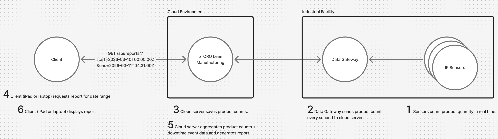
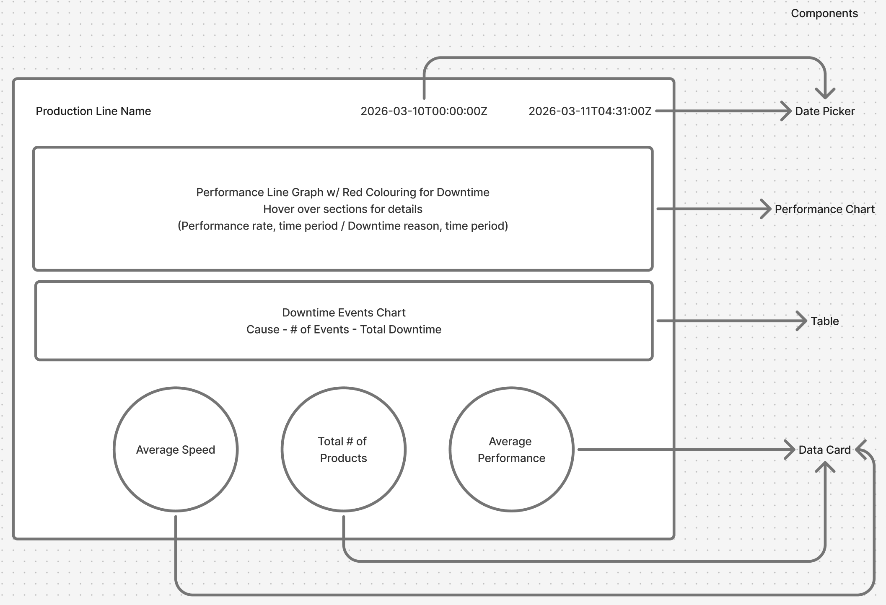

# Starting the App

1. `yarn install`

2. `yarn start`

Runs the app in the development mode.\
Open [http://localhost:3000](http://localhost:3000) to view it in the browser.

# Development Documentation

## Requirements

### Generate a report on the status of a production line

- name of production
- date range selector
- status of line over date range time
  - running, in downtime (unexpected), stopped (expected)
- performance over date range time
  - value between 0-1 for stopped to maximum production speed
  - DESIGN CHOICE
    - Production speed is measured by units produced per second as per the IR sensors
    - Maximum production speed is over the current range, realistically, it would start with a hypothetical figure and be adjusted with historical data
- list of downtime events
  - rank by impact
- production metrics
  - average speed
    - DESIGN CHOICE
      - products produced / total production time in seconds
      - production time: status = running or downtime, excludes expected stoppage times
  - total number of products produced
  - average performance
    - DESIGN CHOICE
      - average speed / maximum speed
      - production time: status = running or downtime, excludes expected stoppage times

## Core Entties

- Production line
- Report: Aggregate of intervals of events
- Interval: consolidation of events
- Event: singular detection event from IR Sensors and Data Gateway

Production line -- one to many --> Report

Report - one to many --> Interval

Interval -- one to many --> Event

## API

### GET /api/report

query params

start: date string

end: date string

ex. /api/report/?start=2026-03-10T00:00:00Z&end=2026-03-11T04:31:00Z

return Report

```
interface Report {
  intervals: ProductionLineInterval[];
  downtimeReport: DowntimeReport[];
  averageSpeed: number;
  totalProductsProduced: number;
  averagePerformance: number;
}

interface ProductionLineInterval {
  id: number;
  status: ProductionLineStatus;
  productsProduced: number;
  startTime: Date;
  endTime: Date;
  downtimeReason?: string;
  speed: number;
  performance: number;
}

interface DowntimeReport {
  name: string;
  numberOfEvents: number;
  totalDowntime: number;
}
```

example

```
{
  "intervals": [
    {
      "id": 1777229032767,
      "status": "RUNNING",
      "productsProduced": 12180,
      "startTime": "2026-04-26T18:43:52.767Z",
      "endTime": "2026-04-26T20:41:06.456Z",
      "speed": 1.731665986369315,
      "performance": 0.25732537407440953
    },
    {
      "id": 1777236066456,
      "status": "RUNNING",
      "productsProduced": 40344,
      "startTime": "2026-04-26T20:41:06.456Z",
      "endTime": "2026-04-26T23:23:07.972Z",
      "speed": 4.149970025251206,
      "performance": 0.616685086818817
    },
    {
      "id": 1777245787972,
      "status": "RUNNING",
      "productsProduced": 16800,
      "startTime": "2026-04-26T23:23:07.972Z",
      "endTime": "2026-04-27T02:17:10.798Z",
      "speed": 1.6087599276287856,
      "performance": 0.2390615473374022
    },
    {
      "id": 1777256230798,
      "status": "STOPPED",
      "productsProduced": 0,
      "startTime": "2026-04-27T02:17:10.798Z",
      "endTime": "2026-04-27T06:27:09.818Z",
      "speed": 0,
      "performance": 0
    },
    {
      "id": 1777271229818,
      "status": "DOWNTIME",
      "productsProduced": 0,
      "startTime": "2026-04-27T06:27:09.818Z",
      "endTime": "2026-04-27T08:05:50.901Z",
      "downtimeReason": "Electrical issue",
      "speed": 0,
      "performance": 0
    },
    {
      "id": 1777277150901,
      "status": "RUNNING",
      "productsProduced": 65107,
      "startTime": "2026-04-27T08:05:50.901Z",
      "endTime": "2026-04-27T10:47:05.794Z",
      "speed": 6.729480108978983,
      "performance": 1
    },
    {
      "id": 1777286825794,
      "status": "STOPPED",
      "productsProduced": 0,
      "startTime": "2026-04-27T10:47:05.794Z",
      "endTime": "2026-04-27T13:15:38.449Z",
      "speed": 0,
      "performance": 0
    },
    {
      "id": 1777295738449,
      "status": "STOPPED",
      "productsProduced": 0,
      "startTime": "2026-04-27T13:15:38.449Z",
      "endTime": "2026-04-27T15:36:29.833Z",
      "speed": 0,
      "performance": 0
    },
    {
      "id": 1777304189833,
      "status": "RUNNING",
      "productsProduced": 9669,
      "startTime": "2026-04-27T15:36:29.833Z",
      "endTime": "2026-04-27T17:39:10.867Z",
      "speed": 1.3135382882350497,
      "performance": 0.19519164437122374
    },
    {
      "id": 1777311550867,
      "status": "STOPPED",
      "productsProduced": 0,
      "startTime": "2026-04-27T17:39:10.867Z",
      "endTime": "2026-04-27T18:40:40.712Z",
      "speed": 0,
      "performance": 0
    },
    {
      "id": 1777315240712,
      "status": "DOWNTIME",
      "productsProduced": 0,
      "startTime": "2026-04-27T18:40:40.712Z",
      "endTime": "2026-04-27T18:43:52.767Z",
      "downtimeReason": "Conveyor belt breakdown",
      "speed": 0,
      "performance": 0
    }
  ],
  "downtimeReport": [
    {
      "name": "Electrical issue",
      "numberOfEvents": 1,
      "totalDowntime": 5921.083
    },
    {
      "name": "Conveyor belt breakdown",
      "numberOfEvents": 1,
      "totalDowntime": 192.055
    }
  ],
  "averageSpeed": 2.8621313133929314,
  "totalProductsProduced": 144100,
  "averagePerformance": 0.3297519503716932
}

```

## High Level Design



DESIGN CHOICE:

backend saves events, aggregates intervals and reports so UI can focus on more heavy data display

## UI Mock Up

Use Cases by Urgency

1. Downtime investigation/analysis
2. Optimization Metrics

→ Focus on downtime UI and have metrics as supporting information



## AI Usage

- Windsurf code autocompletion
- Codex
  - generate framework of UI components
  - fix bugs

## Next Steps

- polish file structure of mock data generation
- unit tests for util functions, UI components
- further testing on iPad
- UI enhancement: production chart hover pop up can cover some data points and be difficult to display
- functionality for toggling between different production lines
